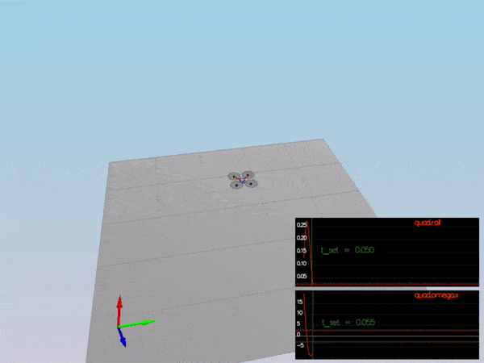
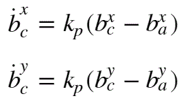
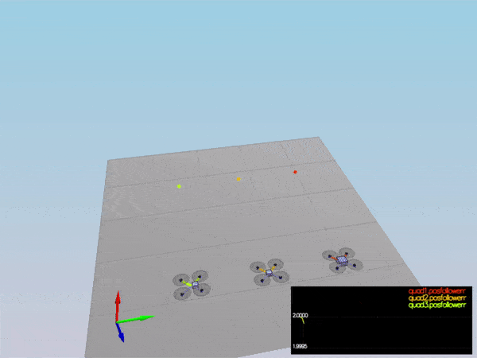
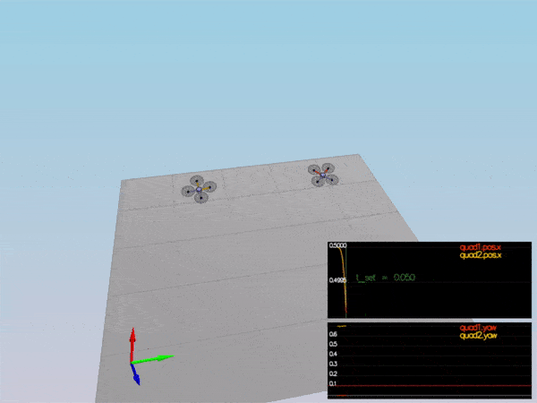
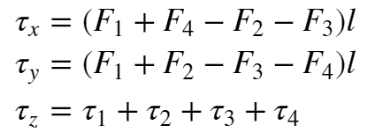
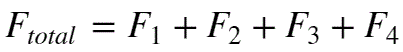
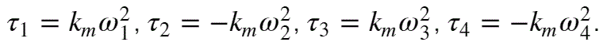
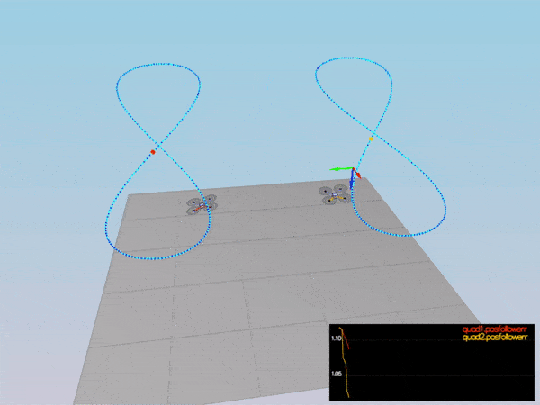

# Udacity Flying Car Nanodegree #
# Project 3: Controls #

## Description ##

In this project, we build and tune a flight controller in C++ in a number of steps, iteratively building functionality for body rate, roll & pitch, position & velocity, and yaw angle quadcopter control within a simulator. 

## Rubric Criteria: Implemented Controller ##

### 1. Implemented body rate control in C++. ###

Body rate control was realized through a proportional controller which made use of the drone's moments of inertia, k_{p, pqr} gain, and calculated error between current and desired body rates, as shown below:

```sh
  // Vectorize moments of inertia
  V3F I(Ixx, Iyy, Izz);

  /// Calculate commanded moments
  momentCmd = I * kpPQR * (pqrCmd - pqr);
```

After this, kpPQR was adjusted in `QuadControlParams.txt` to `kpPQR = 82,95,10` to get the drone to stabilize:




### 2. Implement roll pitch control in C++. ###

The core functionality of the roll-pitch controller is as follows:

```sh
  // Set P controller constants
  float xdd = accelCmd[0];
  float ydd = accelCmd[1];
  float c = - collThrustCmd / mass;
  float kpr = kpBank;
  float kpp = kpBank;
  float bxc = 0.0;
  float byc = 0.0;

  // Limit rotation to desired tilt angle range
  if (collThrustCmd > 0.0)
  {
	  bxc = CONSTRAIN(xdd / c, -maxTiltAngle, maxTiltAngle);
	  byc = CONSTRAIN(ydd / c, -maxTiltAngle, maxTiltAngle);
  }

  // Calculate p and q commanded
  float bxcd = kpr * (bxc - R(0,2)); // bxc_dot
  float bycd = kpp * (byc - R(1,2));
  float pc = (1.f / R(2,2)) * ((R(1,0) * bxcd) - (R(0,0) * bycd));
  float qc = (1.f / R(2,2)) * ((R(1,1) * bxcd) - (R(0,1) * bycd));
  
  V3F pqrCmd(pc, qc, 0);
```

First, acceleration, thrust, attitude rotation matrix, drone mass, and roll and pitch proportional gains are used to establish the P controller constants. Then, after limiting the rotation angle, we calculate the rate of rotation in conjunction with the following equations:



Eventually, we transform the local accelerations in a non-linear fashion to calculate the commanded p and q rotation rates. The result is shown in the above gif.

The scenario of this section posts good performance with roll being less than 0.025 radians for 0.75 seconds or more, while the roll rate stays less than 2.5 radians per second over a similar duration.


### 3. Implement altitude controller in C++. ###

We make use of a PID controller in our calculation of thrust desired to achieve a certain altitude. Here is the code that makes it possible:

```sh
// Abbreviated constants for ease of use
  float kzp = kpPosZ;
  float kzd = kpVelZ;
  float kzi = KiPosZ;

  // Integral portion of PID controller
  integratedAltitudeError += (posZCmd - posZ) * dt;

  // Vertical thrust PID controller equation
  float u_1_bar = kzp * (posZCmd - posZ) + kzd * (velZCmd - velZ) + accelZCmd + integratedAltitudeError * kzi;

  // Limit thrust to max ascent and descent rates
  if (u_1_bar <= 0 && velZ <= maxDescentRate)
  {
	  thrust = - (u_1_bar - 9.81) * mass / R(2, 2);
  } 
  else if (u_1_bar >= 0 && velZ >= maxAscentRate)
  {
	  thrust = - (u_1_bar - 9.81) * mass / R(2, 2);
  }
  else if (velZ >= maxDescentRate && velZ <= maxAscentRate)
  {
	  thrust = - (u_1_bar - 9.81) * mass / R(2, 2);
  }
```

Errors in down position and velocity are both taken into account when calculating the desired thrust, and mass is considered when the output value is delimited by whatever we decide will be our max ascent and descent rates in the latter conditional.

Non-linear effects of non-zero roll and pitch angles are accounted for by way of the rotation matrix element that goes into the thrust equations. Also, kpPosZ and kpVelZ were adjusted to allow for optimum performance in all scenarios.

Lastly, an integrator is used to handle Scenario 4's non-idealities, which is shown below:



We see that the drones, despite their shifted masses, all come within 0.1 meters of their targets in less than 1.5 seconds using this revamped controller.


### 4. Implement lateral position control in C++. ###

The lateral position controller uses local NE position and velocity to generate a commanded local acceleration:

```sh
  // Limit velocity to specified maximums
  velCmd.constrain(-maxSpeedXY, maxSpeedXY);

  // Update feed forward with local position and velocity
  accelCmd += kpPosXY * (posCmd - pos) + kpVelXY * (velCmd - vel);

  // Limit commanded acceleration
  accelCmd.constrain(-maxAccelXY, maxAccelXY);

  // Reset z component to 0
  accelCmd.z = 0;
```

`kpPosXY` and `kpVelXY` are further tuned to get good performance in stopping quickly, as Scenario 3 demonstrates. The drones rapidly attain their targets (within 0.1 meters of them in 1.25 seconds or less), while the second quad comes within 0.1 radians of the target yaw angle within 1 second:




### 5. Implement yaw control in C++. ###

The yaw controller makes use of a linear P controller to adjust its value:

```sh
  // Limit commanded yaw to [0,2*pi]
  yawCmd = fmodf(yawCmd, 2.0 * F_PI);

  // Calculate yaw error and set to standard position of the angle
  float yawError = yawCmd - yaw;

  if (yawError > F_PI)
  {
	  yawError -= 2.0 * F_PI;
  }
  else if (yawError < -F_PI)
  {
	  yawError += 2.0 * F_PI;
  }

  // P controller for yaw
  yawRateCmd = kpYaw * (yawError);
```

The implementation is pretty straightforward with `kpYaw` being a manually-tuned parameter and heading occurring within a standard [0, 2\pi] range. See the image above for a scenario that tests yaw after controller insertion.


### 6. Implement calculating the motor commands given commanded thrust and moments in C++. ###

Individual motor commands were generated by solving a linear equation consisting of x, y, and z rotational moments, alongside total thrust, to derive expressions for the desired individual rotor thrusts. The distance between rotors, l, was derived from the arm length L and incorporated into the calculation, as well.

Here is the code from the `GenerateMotorCommands()` function implementing the equations:

```sh
	// Set rotor-to-rotor distance
	float l = L / std::pow(2.f, 0.5f);

	// Calculate rotational moments
	float tx = momentCmd.x / l;
	float ty = momentCmd.y / l;
	float tz = - momentCmd.z / kappa;
	float F = collThrustCmd;
	float k = kappa;
	
	// Individual thrusts commanded to each rotor
	cmd.desiredThrustsN[0] = (1.f / 4.f) * ( tx + ty + tz + F);
	cmd.desiredThrustsN[1] = (1.f / 4.f) * (-tx + ty - tz + F);
	cmd.desiredThrustsN[3] = (1.f / 4.f) * (-tx - ty + tz + F);
	cmd.desiredThrustsN[2] = (1.f / 4.f) * ( tx - ty - tz + F);
```

These were inspired by the following equations, which were solved for the thrusts \omega_{1} through \omega_{4}:






## Rubric Criteria: Flight Evaluation ##

### 7. Your C++ controller is successfully able to fly the provided test trajectory and visually passes inspection of the scenarios leading up to the test trajectory. ###

Here is the result of our drone flying a followed trajectory:



Our drone, the red one, appears to follow the tracking dot very well, and only slightly has some issues with not bowing out fully along the far ends of the curve. Furthermore, the quad's position error was well within 0.25 meters for at least 3 seconds during the simulation.

For information on all other scenarios, please see the above sections along with their sample images.

